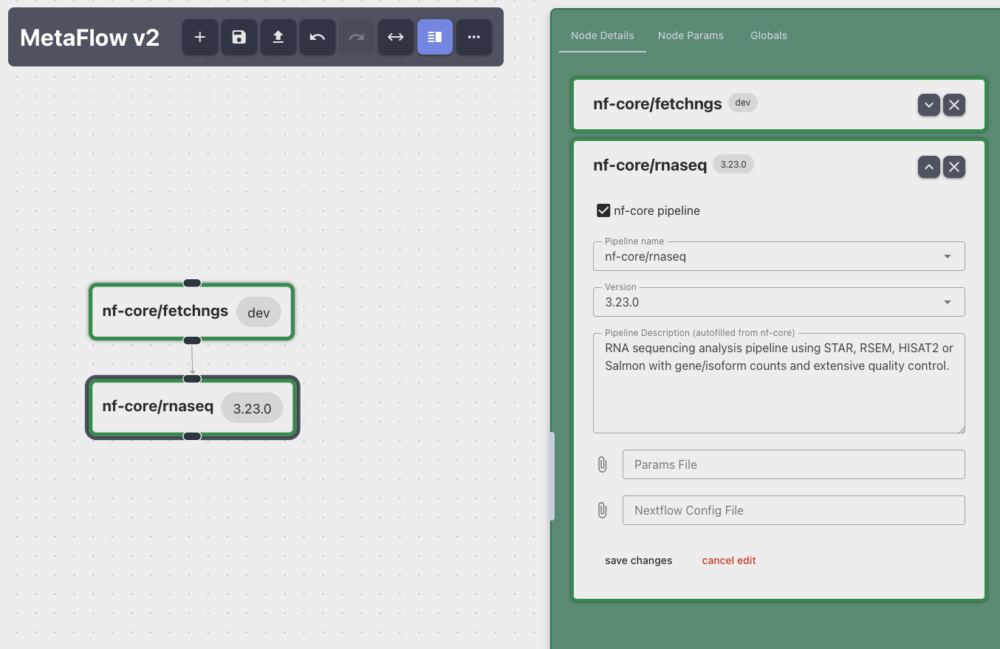

# nf-meta: metapipeline representation, editor, and runner

This project features a reproducible representation for meta-pipelines, featuring an interactive editor running locally in a browser, as well as a cli based validator and runner.

**This is a development/alpha version: Things can be unstable and change**


## Representation

This project proposes a representation for how metapipeline can be generalized in a in `.yml` file format.
The most important keys for a metapipeline in this format are: 
* `config_version` - which allows the representation to change over time without breaking
* `workflows` - lists the nextflow / nf-core pipeline _runs_ 
* `transitions` - describe the flow through the metapipelines
* `globals` - defines settings that apply to all workflows

More sections could follow, potentially starting with a sort of `adapter` key,
where transitions or Groovy glue code is described.

```{yaml}
config_version: 0.0.1
globals:
  nf_profile: docker
workflows:
- id: n02
  name: nf-core/rnaseq
  version: dev
  params:
    outdir: rnaseq-out
    input: fetchngs_out/samplesheet/samplesheet.csv
- id: n01
  name: nf-core/fetchngs
  version: dev
  url: https://api.github.com/repos/nf-core/fetchngs
  params:
    outdir: fetchngs_out
    input: /path/to/ids/acc_ids.csv
    nf_core_rnaseq_strandedness: true
transitions:
- id: c49f
  target: n02
  source: n01
```

This project features at it core validation logic for these sort of `.yml` representations.


To enable referencing fields form other workflows, constructs like could be made possible:
```
    # write this:
    input: ${n01:params:outdir}/samplesheet/samplesheet.csv
    # instead of this:
    input: fetchngs_out/samplesheet/samplesheet.csv
```


## Editor

This project features a small editor which intends to ease the creation and updating
of these config files, by visualizing the config as a graph and 
offering user-firendly form for entering and validating values.




## Metapipeline Runners

Currently:
* Python Runner: Wraps nextflow commands, exectutes in dag order

Planned:
1. [nf-cascade](https://github.com/mahesh-panchal/nf-cascade/) runner: Convert config into one nextflow daisy-chaining nextflow script
2. Seqera Platform runner:
Start and monitor locally, call and poll a Platform instance with run parameters via API to handle running Nextflow
3. Meta-Pipeline runner:
compile config into new monolithic nextflow project, that imports required workflows to achieve most efficient orchestration + graceful errors handling


## Install and run the Development Setup

Install and run the frontend
```
$ cd /src/nf_meta/editor/frontend
$ npm install
$ npm run dev
```

Run the cli in dev mode
```
NF_META_DEVMODE=1 uv run nf-meta editor [</path/to/metapipeline.yml>]
```

## Project Structure


* Engine: Config Validation, Editor Session with History and exposing API
* Runners
* Editor frontend for creating or editing a config

